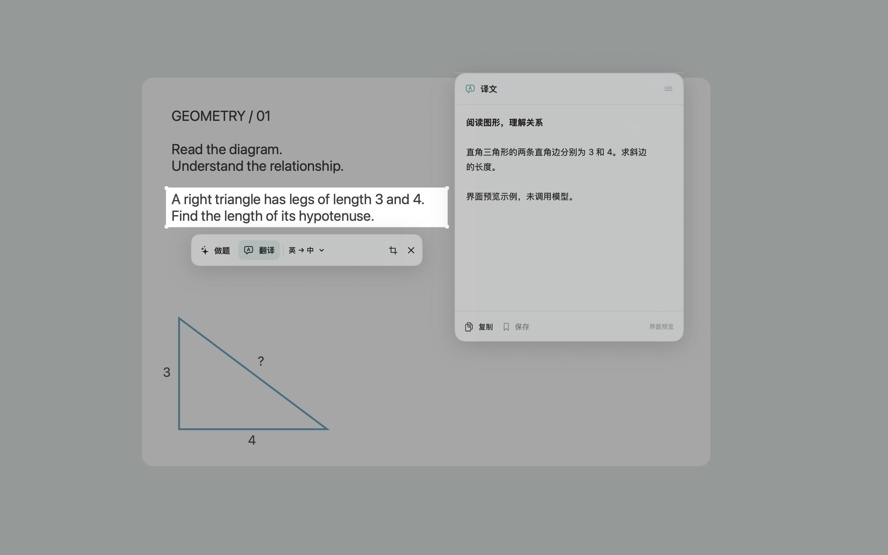

# ScreenGPT


ScreenGPT 是一款 macOS 菜单栏应用：按下快捷键，框选屏幕上的一小块内容，再让 ChatGPT 帮你解题或翻译。它适用于 macOS 14 或更新版本，界面以中文为主。

[下载 v0.1.1 测试版](https://github.com/lhzzzzzzz/ScreenGPT/releases/tag/v0.1.1) · [更新记录](CHANGELOG.md) · [报告问题](https://github.com/lhzzzzzzz/ScreenGPT/issues) · [参与开发](CONTRIBUTING.md)

## 下载与安装

| 下载 | 用途 |
| --- | --- |
| [ScreenGPT-macOS.dmg](https://github.com/lhzzzzzzz/ScreenGPT/releases/download/v0.1.1/ScreenGPT-macOS.dmg) | 推荐：打开后拖到“应用程序” |
| [ScreenGPT-macOS.zip](https://github.com/lhzzzzzzz/ScreenGPT/releases/download/v0.1.1/ScreenGPT-macOS.zip) | 解压得到同一版本的 ScreenGPT.app |
| [SHA256SUMS.txt](https://github.com/lhzzzzzzz/ScreenGPT/releases/download/v0.1.1/SHA256SUMS.txt) | 下载文件的完整性校验 |

需要 **macOS 14+**。安装包同时包含 Apple 芯片与 Intel 架构；Intel 实机尚未验证。使用模型需要联网及具有相应授权的 ChatGPT 账号。

**v0.1.1 是公开测试版，使用临时签名，尚未经过 Apple 公证。** 首次打开可能被 macOS 拦截，请先阅读下方[安装提示](#安装提示)。真实截图后的 AI 请求和其他待验收项目见[验证记录](docs/VERIFICATION.md)。



上图来自安装版的界面预览，使用内置素材和固定示例答案，未调用 ChatGPT。

## 开始使用

1. 下载上面的 DMG，打开后把 ScreenGPT 拖到“应用程序”文件夹。
2. 第一次使用时，在系统设置的“隐私与安全性 → 屏幕录制”中允许 ScreenGPT 截取屏幕。
3. 打开 ScreenGPT，进入“ChatGPT 账号”，选择 **Continue with ChatGPT**，并在浏览器中完成 OpenAI 登录和授权。应用使用 OpenAI 面向开源项目提供的 SIWC OAuth token-sharing 流程，不需要 Codex CLI 或 API key。账号是否可以使用套餐额度，取决于 OpenAI 对该账号、工作区和模型的授权；ScreenGPT 无法保证所有账号都符合条件。详情见 [OpenAI SIWC 说明](https://developers.openai.com/siwc/token-sharing-open-source)。
4. 默认快捷键是 **⌘⇧D**。屏幕变暗后拖动鼠标框选区域，再选择“做题”或“翻译”。按 Escape 取消。

在“ChatGPT 账号”页，可以分别选择**做题模型**和**翻译模型**，各自设置“自动、轻度、中度、高度、极高”思考强度。只显示模型支持且已确认的档位；自动使用模型默认强度。两套设置互不影响，例如做题使用较强的推理模型，翻译使用更快的模型。旧版的单一模型选择会保留为两项的初始值。

若快捷键打开设置而没有进入框选，请查看窗口顶部的提示，并点击“通用 → 去系统授权”允许 ScreenGPT 录制屏幕。授权后点击“重新检测”；若系统开关已开但应用仍提示未授权，请完全退出应用后重新打开。本地临时签名版本更新后，macOS 可能再次要求确认截屏权限或钥匙串访问；账号页的“解锁已保存账号”会触发系统确认，登录凭据仍保留在钥匙串中。

也可以从菜单栏的取景框图标打开设置、开始框选或查看已保存内容。通用设置里可以更改快捷键、翻译语言、屏幕暗度（默认 35%，可调 10%–80%）、浮窗外观和自动保存选项。默认翻译方向为英语到中文，源语言也可设为自动识别。自动保存默认关闭。

## 安装提示

当前 Release 的 `.app`、`.dmg` 和 `.zip` 使用临时 ad hoc 签名，没有 Developer ID 签名或公证。macOS 可能提示无法验证开发者，或阻止首次打开。只在你信任下载来源时，前往系统设置的“隐私与安全性”并选择“仍要打开”；保留系统的安全检查。面向一般用户的正式发行版应使用 Apple Developer ID 签名并完成公证；参见[发布说明](docs/RELEASE.md)。

下载校验文件与安装包到同一文件夹，可运行 `shasum -a 256 -c SHA256SUMS.txt`；校验全部条目时请同时下载 DMG 和 ZIP。

## 从源码构建

需要 Swift 6 或更新版本（Xcode 16 / 对应的 Command Line Tools）及 macOS 14 或更新的 SDK。项目会生成通用 `arm64` 和 `x86_64` 应用包：

```sh
./scripts/package.sh
```

生成的 `.app`、`.dmg` 和 `.zip` 位于 `dist/`。只构建当前机器的 Apple 芯片版本时：

```sh
ARCHS=arm64 ./scripts/package.sh
```

Intel Mac 可用 `ARCHS=x86_64`。开发和人工验收步骤见[开发说明](docs/DEVELOPMENT.md)。发布前请阅读[发布说明](docs/RELEASE.md)。

## 隐私

截图只在你明确点击“做题”或“翻译”后发送选中的裁剪区域。完整屏幕画面用于本机显示和框选，不会作为请求内容发送。登录凭据保存在 macOS 钥匙串中；本地已保存记录包含截图与回答。关于网络请求、历史记录和删除的详细说明见[隐私说明](docs/PRIVACY.md)。

## 项目状态

v0.1.1 提供独立的做题与翻译模型设置，并改善截屏授权提示。43 项自动测试已通过，已生成通用应用和安装包。已在本机观察到账号授权成功、可用模型加载；真实 AI 回答、授权后的系统截屏、跨应用快捷键、Intel 实机、多显示器和公证安装仍需进一步验证。详细结果见[验证记录](docs/VERIFICATION.md)。

ScreenGPT 是独立开源项目，与 OpenAI 无隶属关系。AI 输出可能有误，请结合原始内容核对。

## 许可证

本项目采用 MIT License，见 [LICENSE](LICENSE)。
